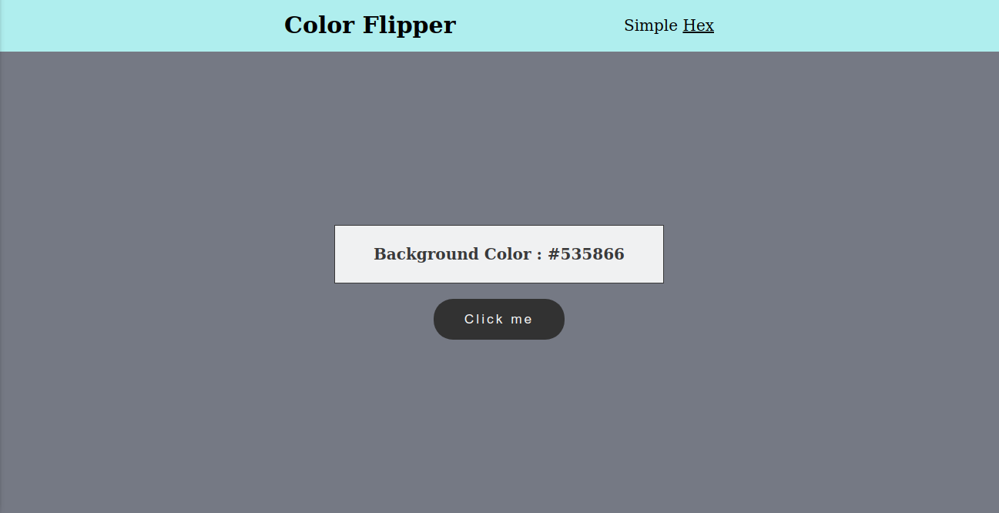

# COLOR FLIPPER

## This is my one of my very first JS projects. 

### Simple
The Simple mode shows you basic colors and switches upon clicking the button

### Hex
The Hex mode shows you countless possibilities of Hex colors upon clicking the button.

Live site link: [here]()
